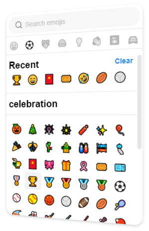

<h1>
    <p align="center">
        Emoji Picker Component
    </p>
    <p align="center">
        
    </p>
</h1>

<p align="center">
    
</p>

## :white_check_mark: Description

Emoji picker component to selected emojis and search by groups. This component is created to work with **ReactJs** and **VueJS**.

## :white_check_mark: Features

- Search emojis by tag name
- Selected emoji
- View recent emojis selected
- Filter emojis by group

## :white_check_mark: Installation

After you clone this repository, go to respective folder and run the command **"npm install"** or **"yarn install"**.
Once the dependencies are installed, yo run the next command according to the technology:

- **ReactJS:**

  ```console
  > npm start
  ```

  Example:

  ```javascript
  import React, { useState } from "react";
  import ReactEmojiPicker from "@bit/personal-dev.emoji-picker.react-emoji-picker";

  function App() {
    const [emoji, setEmoji] = useState("");
    return (
      <div>
        <h1>{emoji}</h1>
        <ReactEmojiPicker onSelected={(currentEmoji) => {
            setEmoji(currentEmoji);
          }}
        />
      </div>
    );
  }
  ```

- **VueJS:**

  ```console
  > npm run serve
  ```

  Example:

  ```html
  <template>
    <div>
      <h1>{{emoji}}</h1>
      <vue-emoji-picker @on-select="onSelectEmoji"></vue-emoji-picker>
    </div>
  </template>
  <script>
    import VueEmojiPicker from "@bit/personal-dev.emoji-picker.vue-emoji-picker";
    export default {
      components: {
        VueEmojiPicker,
      },
      data() {
        return {
          emoji: "",
        };
      },
      methods: {
        onSelectEmoji(emoji) {
          this.emoji = emoji;
        },
      },
    };
  </script>
  ```
